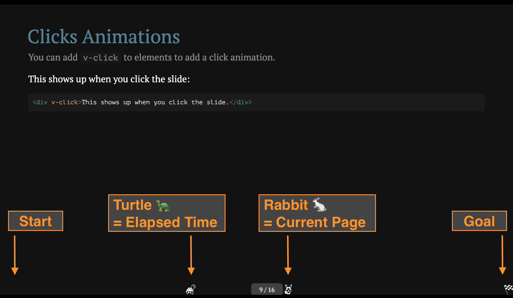

[](https://badge.fury.io/js/slidev-addon-rabbit)
# slidev-addon-rabbit

Presentation time management for slidev inspired by [rabbit\-shocker/rabbit](https://github.com/rabbit-shocker/rabbit/) | [Rabbit \- はじめに](https://rabbit-shocker.org/ja/)

# Demo

https://kaakaa.github.io/slidev-rabbit-turtle/1?time=1


## Description



## Usage

1. Apply `slidev-addon-rabbit` to your slidev project
   - See [Use Addon \| Slidev](https://sli.dev/addons/use.html)
2. Run slidev (e.g.: `npm run dev`)
3. Attach url query `?time=10` to presentation url, and access it
   - e.g.: `http://localhost:3030/?time=10`

## Configs

```
---
theme: seriph
highlighter: shiki
...
addons:
  - slidev-addon-rabbit
rabbit:
  slideNum: true   # Show current/total slide numbers next to a rabbit icon
---
---

# License

This repository distributes under [MIT License](./LICENSE)

Icons used in this slide are distributed from [Emoji One \(Monotone\)](https://icon-sets.iconify.design/emojione-monotone/) under [CC BY 4.0](https://creativecommons.org/licenses/by/4.0/deed.ja).

